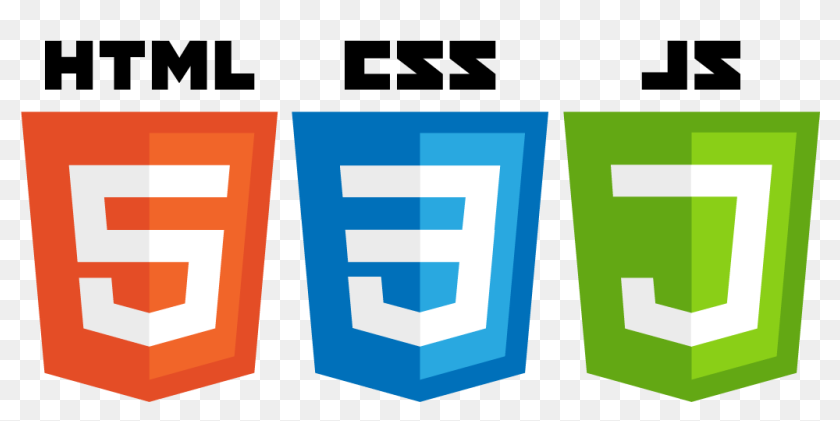

# JavaScript-CODERHOUSE
<h2 align="center">Hi 👋, I'm Mónica Campos</h2>
<h3 align="center">A passionate frontend developer from Córdoba, Argentina</h3>

- 🔭 I’m currently working on [A shopping cart simulator] (https://github.com/MonikCampos/JSPreEntrega1-Campos.git)

- 🌱 I’m currently learning **Full Stack Web Development**

- 📄 Know about my experiences [www.linkedin.com/in/monicaacampos](www.linkedin.com/in/monicaacampos)

<h3 align="left">Connect with me:</h3>

<h3 align="left">Languages and Tools:</h3>

